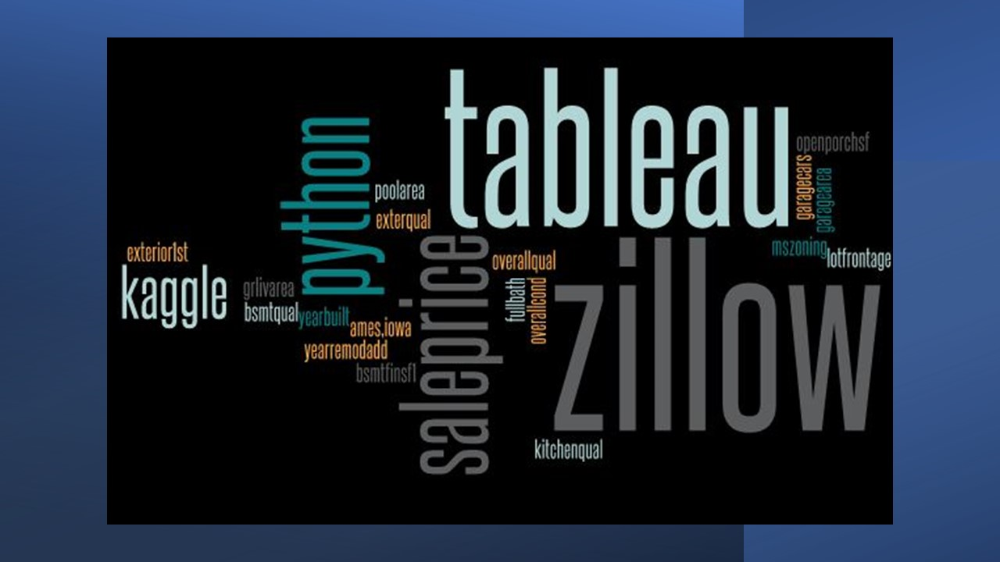
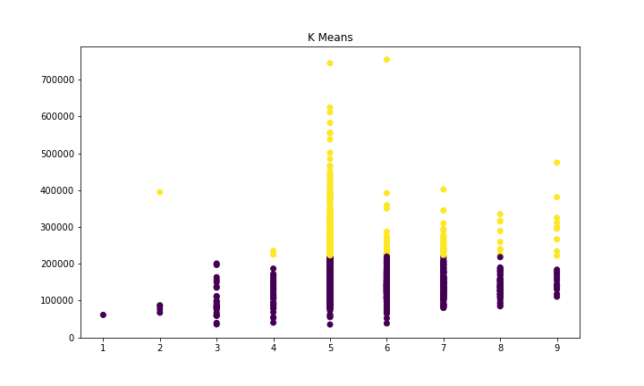

# Predicting Housing Prices - Final Project
#### This is a final project for the Entity Academy/Woz U Data Science course. 

In February 2021, Zillow announced a new home-buying arm of its business using artificial intelligence to make purchases of homes to modestly renovate and resell at a profit. The iBuying plan lasted just 9 months before the company announced it was closing down the venture. During the fourth quarter, Zillow lost an average of about $25,000 on every home it sold, before interest expense, the company said. They posted a loss of $528 million last year, laid off a quarter of their workforce, and were stuck trying to move some 7,000 homes after volatile changes in the market knocked the machine learning algorithm off its price-predicting axis.
 The company has announced to shareholders it is targeting revenue of $5 billion by 2025. Will it rejoin the machine learning push to predict future housing prices? What are some things they can have do differently? 

Predicting housing prices is critical to be able to purchase houses at scale to renovate and resell. It can be risky involving machine learning predictions in making expensive decisions in a market that changed as quickly as it did last summer when Covid made its appearance. It can be difficult to predict months out with a market that is hard to quantify in terms of what buyers are looking for, and what they're willing to pay. 

## 1. Kaggle Dataset 
This dataset is available from Kaggle and contains 79 columns (independent variables) that indicate characteristics of the 1,460 houses. It contains one response variable: Sale Price. Housing dataset contains homes sold between 2006-2010 in Ames, Iowa.

#### The original data can be found at [Kaggle](https://www.kaggle.com/marcopale/housing/).

## 2. Data Cleaning 
    - Mitigated missing values and data types. 
    - LotFrontage null values received an average of all frontage values; other columns were dropped. 
    - Label encoding, replacing categorical values with numeric using a simple for loop. 
    

## 3. Exploratory Data Analysis
    -Summary statistics, graphs and check for normal distribution, if needed.
   - [Exploratory Analysis in Python - Relative Path](./Exploratory%20Analysis%20in%20Python/Visualization%20in%20Python.ipynb)
## 4. Data Analysis in R 

   - [Housing Analysis in R - Absolute Path](https://github.com/M-arcy/Feb2022FinalProject/blob/main/Data%20Analysis%20in%20R/House%20analysis%20in%20R.ipynb)
   - [Housing Analysis in R - Relative Path](./Data%20Analysis%20in%20R/House%20analysis%20in%20R.ipynb)

## 5. Data Visualization using Python, Tableau, Excel and R
    - bar graphs, scatter plots, histogram, correlation plot, heat map
    - save to png for use in slide deck presentation.

One of the more interesting visualizations revealed where investment opportunities lie within this dataset. Houses on the lower end of the overall condition score are selling at lower prices: these are the homes that would benefit from remodeling and selling at a higher price. 

## 6. Splitting into training and testing sets. Assessing K Nearest Neighbors, Random Forest, Stepwise regression.

## 7. Check performance of the model. 

## 8. Github Stats

## Presentation
#### **Presented February 21, 2022 via Zoom to students, faculty and prospective employers.**

#### View the project presentation video here, on [Vimeo](https://vimeo.com/680143023/). 

###### Instructor critique begins at 35:17.

